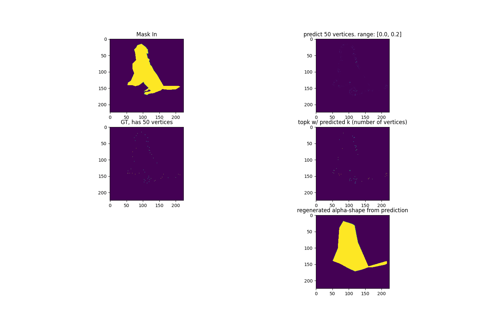
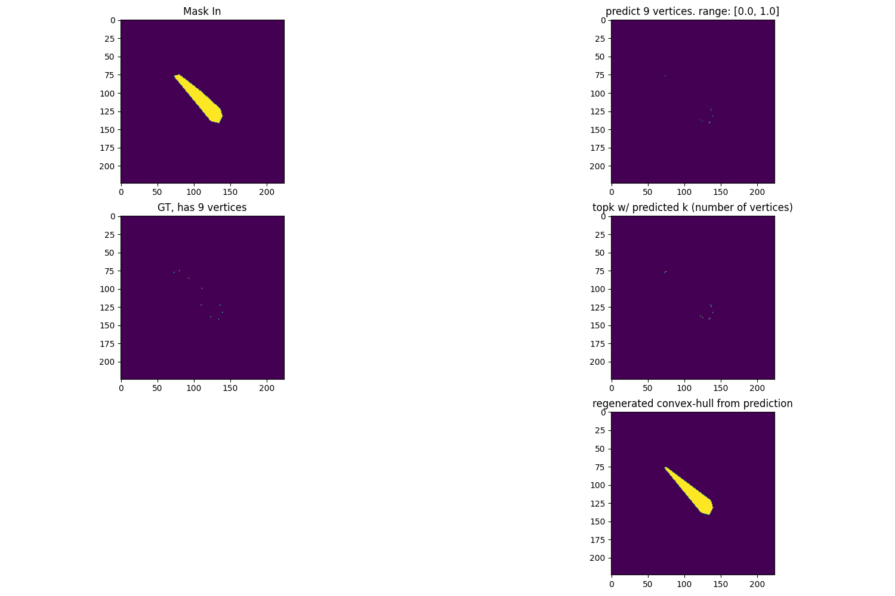
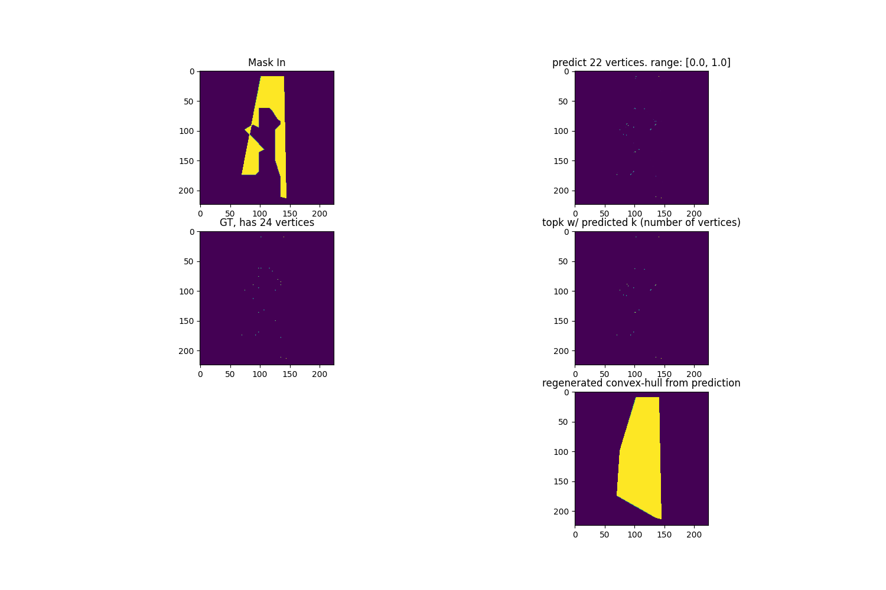
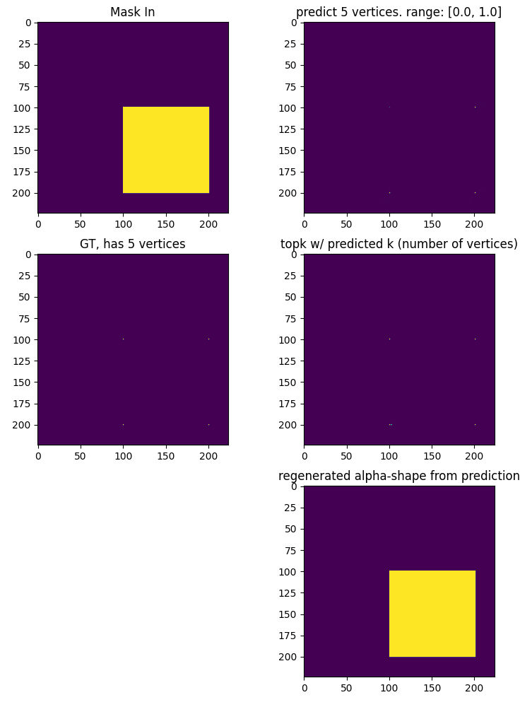

# Mask Simplifier

Mask Simplifier aims to provide a way for producing a simplified polygon from an output mask from an instance segmentation model.

Researching ideas for [end-to-end segmentation with polygon predictions](docs/research.md).

### Initial Model

The model contains 5 layers of 3x3 convolutions to extract features and an output layer to get the desired single channel out. The layers maintain the same image dimension with (1,1) padding and (1,1) stride. 

After each layer the output from the previous layer is added after being passed through a 1x1 convolution to reduce the channels to 1 to hopefully allow gradients to flow to earlier layers.

### UNet Model
A UNet with ResNet18 feature extractor was also experimented with. It gave better Dice score, and took up less memory (as it doesn't maintain the dimensionality) when training, allowing for a larger batch size. 

This model was modified with sigmoid activation and the same maxpooling -> maxunpooling as was done with the initial model.

### Vertex Detection

To predict the vertices the activations from the output layer are maxpooled using a 5x5 kernel and (2,2) padding, then the dimensionality is brought back up using a 2D maxunpooling layer. This only allows for 
one activation in a 5x5 neighbourhood. This has a few effects: (1) so later on when we take the topk the activations aren't densely packed in a small area, (2) to force the model to learn the difference between an edge and a vertex. 

### Detecting Number of Vertices 

The output of the vertex detection is average pooled 3 times to reduce the dimensionality to 28x28. 
Average pooling is used instead of max pooling to preserve multiple activations in the one window. 

After this an MLP head with one hidden layer is used to output the one-hot encoded number of vertices.

### Angle Detection

Currently experimenting with predicting the angles at each pixel, to help influence the reconstruction of the polygon.

### Regenerating shape from prediction

Currently using **alphashape** pip library to regenerate the shapes, with alpha given by optimizealpha function.

## Dataset

Polygons are extracted from instance segmentation labels from the [COCO Dataset](https://cocodataset.org/). 
They are padded to a square image and rescaled down to 224x224. 

### Augmentations

The number of vertices is scaled down to less than or equal to 50 using [Ramer-Douglas-Peucker](https://en.wikipedia.org/wiki/Ramer%E2%80%93Douglas%E2%80%93Peucker_algorithm) using the **rdp** pip library.

During training, the polygons are resized if they are less than 50px wide or tall. The polygons are also centered by taking the difference between the mean of the vertices and moving it to the center of the image.

## Some Predictions

